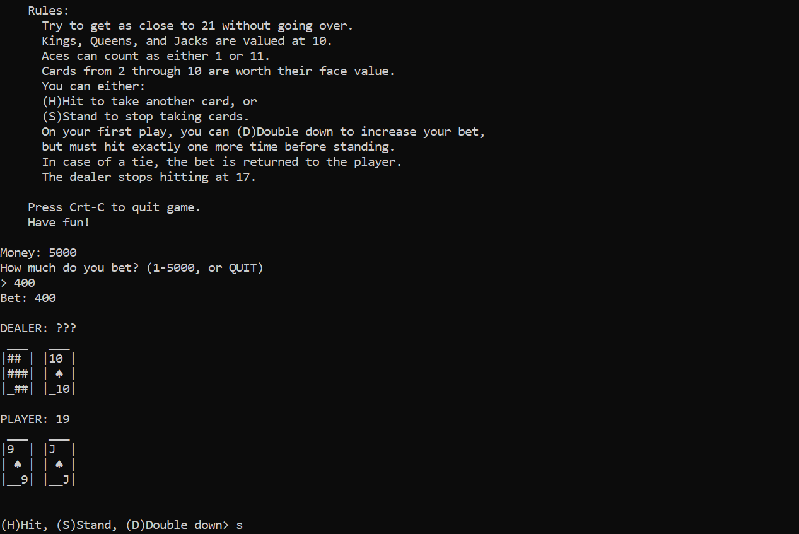
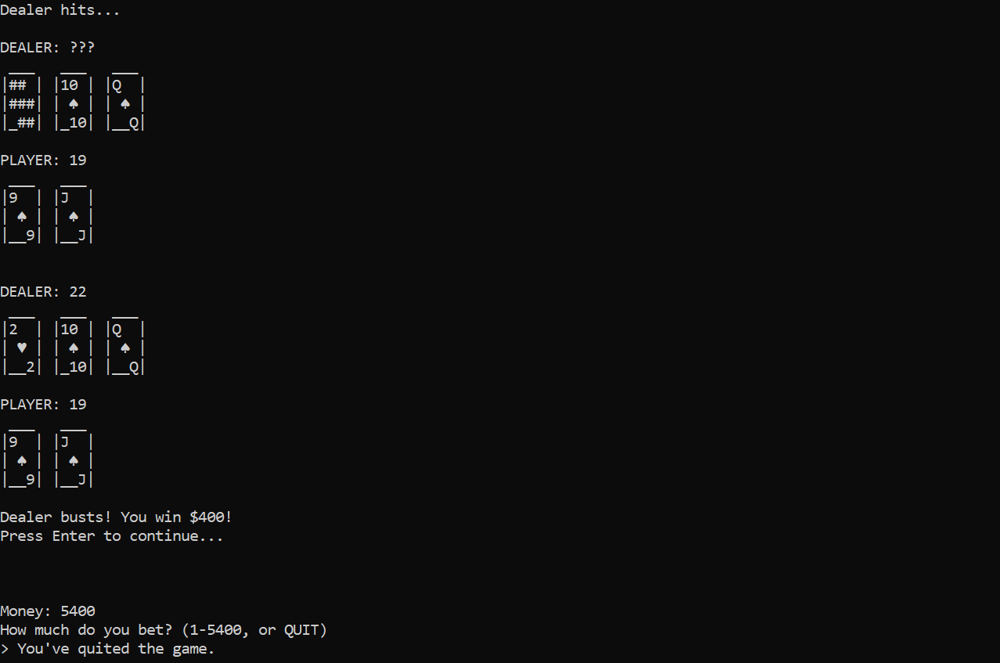

# Black-Jack

## Description
This program simulates a real Backjack card game with text characters. 
Players start with $5,000 chips, and can do three operations including hit, stand, and doubling down (But not splitting and insurance).
The program will display cards on terminal, ask for player action, and determine player's win or loss. 

## Prerequisite
No prerequisite needed. 

## How to run
run ```python black_jack.py```

## Program in Action
When running the program, it would look like this:



Hopes you win the game too :)


